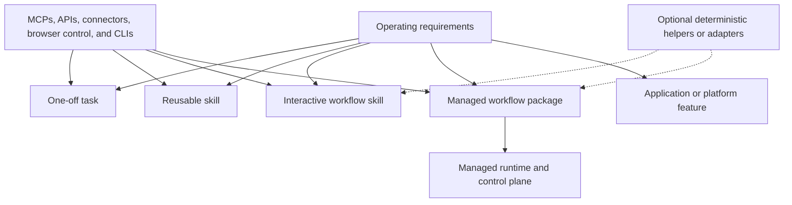

# Agent Platform Documentation

This page is the navigation hub for the Headstart Agent Platform. Start here when deciding where a
new agent capability belongs, when changing more than one package, or when orienting an agent that
has not worked in this repository before.

## Start By Intent

| Goal                                                               | Start here                                                                                      | Continue with                                                                                                                                                              |
| ------------------------------------------------------------------ | ----------------------------------------------------------------------------------------------- | -------------------------------------------------------------------------------------------------------------------------------------------------------------------------- |
| Use or update the shared workstation skills                        | [Root README](../README.md#local-installation)                                                  | [`headstart-skills-update`](../skills/headstart-skills-update/SKILL.md)                                                                                                    |
| Reuse one workflow across local and managed execution              | [Root README](../README.md#local-and-managed-consumption)                                       | [Workflow authoring guide](workflow-authoring-guide.md#design-for-local-and-managed-consumption), [workflow composition](../standards/workflow-composition.md)             |
| Create one reusable capability                                     | [`headstart-agent-workflow-authoring`](../skills/headstart-agent-workflow-authoring/SKILL.md)   | [Workflow authoring guide](workflow-authoring-guide.md), [portable skill contract](../standards/portable-skill-contract.md)                                                |
| Compose several skills for an interactive Codex workflow           | [Workflow authoring guide](workflow-authoring-guide.md)                                         | [`headstart-discovery-to-decision`](../skills/headstart-discovery-to-decision/SKILL.md), [workflow composition](../standards/workflow-composition.md)                      |
| Choose one-pass, quality-loop, or graph execution                  | [Execution topology](workflow-authoring-guide.md#choose-execution-topology-separately)          | [Workflow composition](../standards/workflow-composition.md#control-flow-topology), [testing and release](../standards/testing-and-release.md)                             |
| Add deterministic parsing, validation, or transformation           | [Workflow authoring guide](workflow-authoring-guide.md#choose-where-deterministic-code-belongs) | [`headstart-dev-to-main-pr`](../skills/headstart-dev-to-main-pr/SKILL.md), [testing and release](../standards/testing-and-release.md)                                      |
| Maintain public-repository security controls                       | [Public repository security](public-repository-security.md)                                     | [Security policy](../SECURITY.md), [security and data handling](../standards/security-and-data-handling.md), [testing and release](../standards/testing-and-release.md)    |
| Make a workflow scheduled, event-driven, or independently operated | [Managed workflow architecture](codex-managed-workflow-architecture.md)                         | [Workflow contracts](../packages/workflow-contracts/README.md), [workflow runtime](../packages/workflow-runtime/README.md), [Codex runner](../apps/codex-runner/README.md) |
| Add a managed workflow package                                     | [Workflow authoring guide](workflow-authoring-guide.md#managed-workflow-package)                | [Synthetic reference workflow](../workflows/synthetic-read-only-reference/README.md), [managed workflow architecture](codex-managed-workflow-architecture.md)              |
| Complete the managed runtime foundation                            | [Managed runtime completion roadmap](managed-runtime-completion-roadmap.md)                     | [Managed workflow architecture](codex-managed-workflow-architecture.md), [Codex runner](../apps/codex-runner/README.md)                                                    |
| Change repository-wide engineering policy                          | [Repository guide](../AGENTS.md)                                                                | [Testing and release](../standards/testing-and-release.md), [security and data handling](../standards/security-and-data-handling.md)                                       |

## Choose The Smallest Durable Shape

For a new code repository or an explicit quality-baseline adoption, use
[`headstart-engineering-setup`](../skills/headstart-engineering-setup/SKILL.md). It includes working
TypeScript configuration examples, repository-instruction design, conditional database integration
testing, and criteria for pnpm/Turborepo package boundaries. It does not require code for prompt-only
workflows or a monorepo for a single program.

Do not begin by choosing a framework or cloud runtime. Begin with the operating requirement:

These are stable design options, not a maturity ladder. Choose supervised versus managed execution
separately from choosing guidance-only versus deterministic implementation support. A recurring
skill that uses existing MCPs or APIs can be the final design.

1. Keep one-off work in the current agent task unless the result needs a durable owner.
2. Create a reusable skill when multiple people or workflows need the same bounded judgment or
   procedure.
3. Create a workflow skill when an interactive agent should sequence several capabilities while a
   person remains present for context, approvals, and exception handling.
4. Add deterministic helper code only for behavior that benefits from reproducibility, stronger
   typing, or focused tests.
5. Add a managed workflow package only when execution must be independent of an employee laptop or
   needs explicit triggers, service identity, durable state, retries, observability, or operational
   ownership.
6. Keep business-system authority, durable writes, and application interfaces in their owning
   service repositories.

The [workflow authoring guide](workflow-authoring-guide.md) provides the complete decision process
and examples.

## Concrete Examples

- [`headstart-discovery-to-decision`](../skills/headstart-discovery-to-decision/SKILL.md) shows an
  interactive workflow skill composing several bounded capabilities while a person remains present.
- [`headstart-dev-to-main-pr`](../skills/headstart-dev-to-main-pr/SKILL.md) shows a code-assisted
  interactive workflow: agent judgment coordinates a deterministic, fixture-tested collector.
- [`synthetic-read-only-reference`](../workflows/synthetic-read-only-reference/README.md) shows the
  package contract for a disabled managed workflow. It is not an example of a deployable live
  workflow.

## Repository Map

- [`skills/`](../skills/) owns portable capabilities and interactive workflow guidance.
- [`headstart-agent-workflow-authoring`](../skills/headstart-agent-workflow-authoring/SKILL.md) is
  the globally installable entry point for selecting an artifact shape before implementation.
- [`workflows/`](../workflows/) owns deployable workflow prompts, schemas, policies, and
  optional workflow-specific deterministic adapters.
- [`packages/workflow-contracts/`](../packages/workflow-contracts/README.md) owns runtime-neutral
  workflow and durable-run contracts.
- [`packages/workflow-runtime/`](../packages/workflow-runtime/README.md) owns safe package loading,
  referenced-file resolution, and JSON Schema validation used by both tests and managed execution.
- [`apps/codex-runner/`](../apps/codex-runner/README.md) owns the managed Codex execution boundary.
- Headstart application repositories retain triggers, durable business state, permissions,
  idempotent business writes, and application interfaces. The selected operational control plane
  owns run scheduling/history and operator controls; custom backend/admin implementation is
  conditional on the architecture's build-versus-buy decision.

## Standards

- [Portable skill contract](../standards/portable-skill-contract.md) defines the canonical
  cross-agent skill format.
- [Workflow composition](../standards/workflow-composition.md) defines dependency, orchestration,
  and managed-execution boundaries.
- [Tool capabilities](../standards/tool-capabilities.md) defines how skills refer to MCPs, native
  connectors, browser control, APIs, and CLIs.
- [Knowledge workflow sources](../standards/knowledge-workflow-sources.md) defines source authority
  and write boundaries for Google Docs, Gmail, Linear, Notion, repositories, and meeting evidence.
- [Security and data handling](../standards/security-and-data-handling.md) defines repository and
  runtime safety requirements.
- [Public repository security](public-repository-security.md) defines the source-controlled and
  GitHub-hosted controls required for public operation.
- [Testing and release](../standards/testing-and-release.md) defines evaluations, deterministic
  tests, quality gates, and release evidence.

## Sources Of Truth

- [Root README](../README.md) is the human-facing repository overview and setup entry point.
- [Repository guide](../AGENTS.md) is the canonical instruction set for coding agents and
  contributors.
- This page is the canonical documentation index.
- [Workflow authoring guide](workflow-authoring-guide.md) owns the workflow-shape decision process.
- [Managed workflow architecture](codex-managed-workflow-architecture.md) owns the managed runtime
  design and current implementation boundary.
- [Managed runtime completion roadmap](managed-runtime-completion-roadmap.md) owns the ordered work
  required to prove the shared runtime foundation with synthetic packages, including hosting and
  operations decisions, then separately admit real business workflows.
- Package READMEs own package-level behavior and limitations.
- Standards own cross-cutting rules; they do not own volatile project or deployment status.

When adding a canonical document under `docs/` or `standards/`, link it from this page. Package,
application, and workflow READMEs should link back here so an unfamiliar agent can move in both
directions through the documentation graph.
